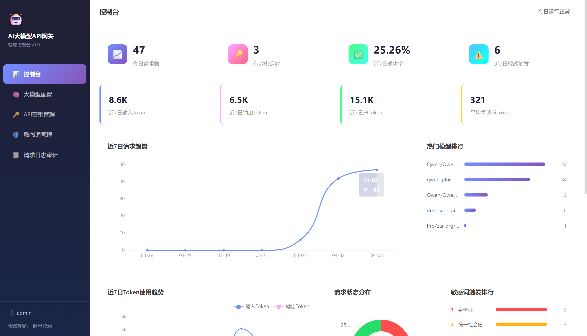
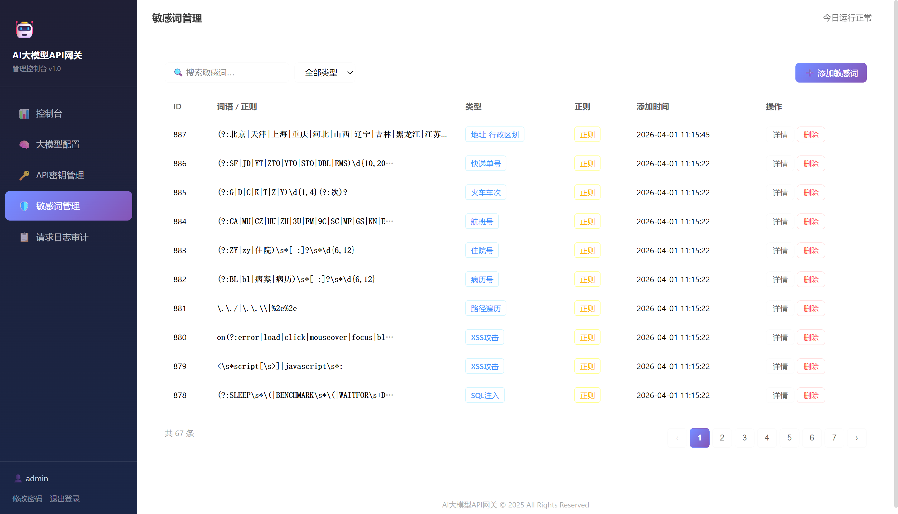
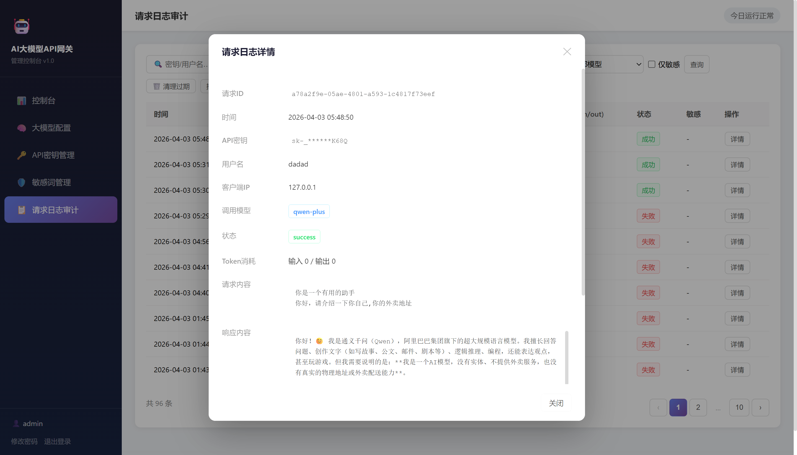

# AI大模型API网关

一个统一代理各类大模型API接口的网关系统，实现API密钥精细化管控、访问权限控制、全量请求日志审计、敏感信息/关键词检测。







## 核心功能

1. **统一代理服务**：兼容主流大模型API（OpenAI、文心一言、通义千问、讯飞星火、Gemini等）
2. **API密钥管理**：密钥全生命周期管理，支持精细化权限、额度、Token用量限额、调用频率控制
3. **请求日志审计**：完整记录每一次AI请求/响应日志，支持多维度筛选
4. **敏感信息检测**：内置58条预置正则规则（证件、银行卡、手机号、SQL注入等），支持自定义敏感词与违规内容拦截
5. **Web管理后台**：轻量化管理后台，Dashboard可视化图表（ECharts），支持配置、监控、审计、管理操作

## 技术架构

- **后端框架**：FastAPI（高性能异步API框架）
- **数据库**：PostgreSQL（存储配置、密钥、日志、权限数据）
- **前端**：原生HTML + JavaScript + CSS + ECharts（轻量化管理后台）
- **中间件**：asyncpg异步PG驱动、aiohttp请求代理、JWT身份认证、passlib+bcrypt密码加密

## 快速开始

### 1. 环境准备

确保已安装：
- Python 3.9+
- PostgreSQL 12+

### 2. 安装依赖

```bash
pip install -r requirements.txt
```

### 3. 数据库配置

创建PostgreSQL数据库：

```sql
CREATE DATABASE ai_gateway;
```

复制配置模板并修改：

```bash
cp config.example.py config.py
```

编辑 `config.py` 中的数据库连接信息。

### 4. 初始化数据库

运行数据库初始化脚本：

```bash
python init_database.py
```

或直接执行SQL：

```bash
psql -d ai_gateway -f init.sql
```

### 5. 启动服务

**手动启动**：

```bash
uvicorn main:app --host 0.0.0.0 --port 8080 --reload
```

## 默认管理员账号

- 用户名：admin
- 密码：admin123

**注意**：首次登录后请立即修改密码。

## 服务地址

- **管理后台**：http://localhost:8080/static/index.html
- **登录页面**：http://localhost:8080/static/login.html
- **API文档**：http://localhost:8080/docs

## 目录结构

```
ai-gateway/
├── main.py                 # FastAPI入口（含所有管理接口路由）
├── config.py               # 全局配置
├── config.example.py       # 配置模板
├── database.py             # PG数据库连接池
├── init_database.py        # 数据库初始化脚本
├── init.sql                # 建表SQL + 预置数据
├── requirements.txt        # Python依赖清单
├── Dockerfile              # Docker镜像构建
├── docker-compose.yml      # Docker编排（含PG）
├── api/
│   ├── key.py              # API密钥管理
│   └── sensitive.py        # 敏感词管理
├── service/
│   ├── auth_service.py     # JWT认证 + bcrypt密码加密
│   ├── llm_service.py      # 大模型转发（支持流式）
│   ├── sensitive_service.py # 敏感词检测（正则 + PII）
│   └── log_service.py      # Dashboard统计 + 日志服务
├── models/
│   └── __init__.py         # Pydantic数据模型
└── static/
    ├── index.html          # 管理后台主页面
    ├── login.html          # 登录页
    ├── css/
    │   └── style.css       # 样式文件
    └── js/
        ├── app.js          # 前端逻辑
        └── echarts.min.js  # ECharts图表库
```

## 获取与使用 API 密钥

### 第一步：创建密钥

1. 登录管理后台（默认账号 `admin` / `admin123`）
2. 进入 **密钥管理** 面板
3. 点击 **添加密钥**，填写：
   - **用户名**：标识此密钥的使用者
   - **可用模型**：勾选该密钥允许调用的大模型
   - **频率限制**：每秒最大请求数（QPS）
   - **日限额 / 月限额**：调用次数上限（0 表示不限制）
   - **Token 限额**：Token 总用量上限（0 表示不限制）
   - **IP 白名单**：留空表示不限制，多个 IP 用逗号分隔
4. 点击 **确定** 创建，系统会生成一个密钥值（**仅显示一次，请立即复制保存**）

### 第二步：使用密钥调用 API

将网关密钥作为 Bearer Token，向网关发起请求。请求格式与 OpenAI API 完全兼容：

**非流式请求：**

```bash
curl http://<网关地址>:8080/v1/chat/completions \
  -H "Authorization: Bearer <你的网关密钥>" \
  -H "Content-Type: application/json" \
  -d '{
    "model": "gpt-3.5-turbo",
    "messages": [
      {"role": "user", "content": "你好，请介绍一下自己"}
    ]
  }'
```

**流式请求（SSE）：**

```bash
curl http://<网关地址>:8080/v1/chat/completions \
  -H "Authorization: Bearer <你的网关密钥>" \
  -H "Content-Type: application/json" \
  -d '{
    "model": "gpt-3.5-turbo",
    "messages": [
      {"role": "user", "content": "你好，请介绍一下自己"}
    ],
    "stream": true
  }'
```

### 第三步：在应用中集成

由于网关接口完全兼容 OpenAI API 格式，你可以直接将网关地址替换 OpenAI 的 Base URL，无需修改客户端代码：

**Python（openai SDK）：**

```python
from openai import OpenAI

client = OpenAI(
    api_key="<你的网关密钥>",
    base_url="http://<网关地址>:8080/v1"
)

response = client.chat.completions.create(
    model="gpt-3.5-turbo",
    messages=[{"role": "user", "content": "你好"}]
)
print(response.choices[0].message.content)
```

**Node.js：**

```javascript
import OpenAI from "openai";

const client = new OpenAI({
  apiKey: "<你的网关密钥>",
  baseURL: "http://<网关地址>:8080/v1"
});

const response = await client.chat.completions.create({
  model: "gpt-3.5-turbo",
  messages: [{ role: "user", content: "你好" }]
});
console.log(response.choices[0].message.content);
```

**其他兼容 OpenAI 格式的客户端**（如 ChatGPT-Next-Web、LobeChat 等）：

只需将 **API Base URL** 设置为 `http://<网关地址>:8080/v1`，**API Key** 填入网关密钥即可。

> **提示**：`model` 字段填写的是你在管理后台「模型管理」中配置的模型名称（如 `gpt-3.5-turbo`、`qwen-plus`、`ernie-bot` 等），网关会自动将请求路由到对应的上游 API。

## API接口

### 客户端代理接口

```http
POST /v1/chat/completions
Authorization: Bearer {网关密钥}
Content-Type: application/json

{
    "model": "gpt-3.5-turbo",
    "messages": [
        {"role": "user", "content": "Hello!"}
    ]
}
```

### 管理后台接口

#### 登录认证
```http
POST /login
Content-Type: application/json

{
    "username": "admin",
    "password": "admin123"
}
```

#### Dashboard统计
```http
GET /api/dashboard/stats
Authorization: Bearer {JWT Token}
```

#### 大模型配置
```http
GET  /api/llm/list
POST /api/llm/create
PUT  /api/llm/{id}
DELETE /api/llm/{id}
```

#### API密钥管理
```http
GET  /api/key/list
POST /api/key/create
PUT  /api/key/{id}
DELETE /api/key/{id}
```

#### 敏感词管理
```http
GET  /api/sensitive/list
POST /api/sensitive/create
PUT  /api/sensitive/{id}
DELETE /api/sensitive/{id}
```

#### 日志查询
```http
GET /api/logs/list?&page=1&page_size=20
```

支持筛选参数：`start_time`, `end_time`, `api_key`, `log_status`, `llm_name`, `client_ip`, `sensitive_only`

#### 修改密码
```http
POST /api/admin/change-password
Authorization: Bearer {JWT Token}
Content-Type: application/json

{
    "old_password": "原密码",
    "new_password": "新密码"
}
```

## 数据库表结构

> 完整建表语句见 `init.sql`，以下为主要表结构说明。

| 表名 | 说明 |
|------|------|
| `admin` | 管理员表（username, password） |
| `llm_config` | 大模型配置（llm_name, api_url, api_key） |
| `api_key` | API密钥（key_value, user_name, rate_limit, daily_limit, monthly_limit, token_limit, ip_whitelist） |
| `sensitive_words` | 敏感词（word, type, is_regex, is_preset） |
| `sensitive_config` | 敏感词检测配置（mode, check_request, check_response, enable_pii_detection） |
| `request_logs` | 请求日志（request_id, api_key, llm_name, prompt_tokens, completion_tokens, sensitive_result TEXT） |
| `system_config` | 系统配置（config_key, config_value） |

## 部署方式

### Docker Compose 部署

一键启动全部服务（应用 + PostgreSQL）：

```bash
docker-compose up -d
```

默认端口映射：`8080`（应用）、`5432`（数据库）。

首次启动会自动通过 `init.sql` 初始化数据库表结构和默认数据。

**自定义配置**：编辑 `docker-compose.yml` 中的环境变量，特别是 `SECRET_KEY` 和数据库密码。

### 传统部署

1. 安装 Python 3.9+ 和 PostgreSQL 12+
2. 复制 `config.example.py` 为 `config.py` 并修改配置
3. 执行 `python init_database.py` 初始化数据库
4. 运行 `uvicorn main:app --host 0.0.0.0 --port 8080`
5. 配置反向代理（Nginx + HTTPS）

## 安全建议

1. **修改默认密码**：首次登录后立即修改管理员密码
2. **修改SECRET_KEY**：生产环境必须更换JWT密钥
3. **密钥管理**：妥善保管网关分配的API密钥和上游模型API密钥
4. **网络隔离**：将网关部署在内网，通过防火墙控制访问
5. **定期审计**：定期检查日志和敏感词触发记录
6. **备份数据库**：定期备份PostgreSQL数据库
7. **HTTPS加密**：生产环境建议配置HTTPS

## 故障排除

### 1. 数据库连接失败
- 检查PostgreSQL服务是否运行
- 检查 `config.py` 中的 `DATABASE_URL` 配置
- 验证用户名和密码是否正确

### 2. 代理转发失败
- 检查大模型API配置是否正确（管理后台 → 模型管理）
- 验证上游API密钥是否有效
- 检查网络连接是否正常

### 3. 前端页面无法访问
- 确认服务已启动（http://localhost:8080/docs 能访问）
- 检查 `static/` 目录是否存在
- 检查浏览器控制台错误

### 4. bcrypt版本冲突
- 项目依赖 `bcrypt==3.2.2`，请勿升级到 4.x/5.x（与passlib不兼容）
- 如需重新安装：`pip install bcrypt==3.2.2`

## 许可证

本项目采用 MIT 许可证。
